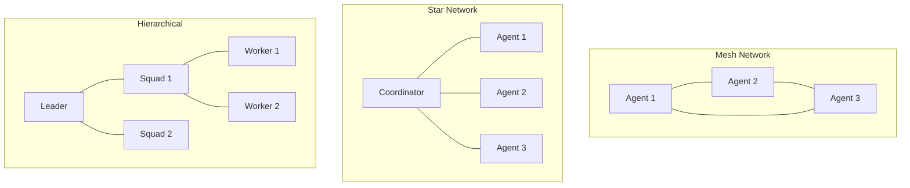

# ruv-swarm 🧠🐝

[](https://www.rust-lang.org)
[](https://webassembly.org/)
[](LICENSE)
[](https://www.npmjs.com/package/@ruv/swarm)

A high-performance, cognitive diversity-enabled distributed agent orchestration framework built on ruv-FANN neural networks. Deploy anywhere from native Rust to WebAssembly, with seamless integration into modern development workflows.

## ✨ Features

- 🧠 **Cognitive Diversity**: Multiple thinking patterns (convergent, divergent, lateral, systems)
- 🚀 **High Performance**: Built on ruv-FANN with SIMD optimization
- 🌐 **Universal Deployment**: Native Rust, WebAssembly, NPX installation
- 🔄 **Multiple Topologies**: Mesh, star, hierarchical, ring, and custom networks
- 💾 **Persistent State**: SQLite, IndexedDB, and in-memory backends
- 🔧 **MCP Integration**: Native Model Context Protocol support for claude-flow
- 📊 **Real-time Monitoring**: Built-in metrics and event streaming
- 🎯 **Type-Safe**: Full TypeScript definitions and Rust type safety

## 🚀 Quick Start

### NPX Installation (Recommended)
```bash
# Initialize a new swarm
npx @ruv/swarm init --topology mesh --agents 3

# Spawn specialized agents
npx @ruv/swarm spawn researcher --capabilities "search,analyze"
npx @ruv/swarm spawn coder --capabilities "implement,debug"

# Orchestrate distributed tasks
npx @ruv/swarm orchestrate --strategy cognitive-diversity "Build authentication system"
```

### Rust Crate
```toml
[dependencies]
ruv-swarm = "0.1.0"
```

```rust
use ruv_swarm::{Swarm, SwarmConfig, AgentType, CognitivePattern};

#[tokio::main]
async fn main() -> Result<(), Box<dyn std::error::Error>> {
    // Create swarm with cognitive diversity
    let swarm = Swarm::new(SwarmConfig {
        max_agents: 10,
        cognitive_patterns: vec![
            CognitivePattern::Convergent,
            CognitivePattern::Divergent,
            CognitivePattern::Lateral
        ],
        ..Default::default()
    })?;
    
    // Spawn agents with different thinking patterns
    let researcher = swarm.spawn_agent(AgentType::Worker, Some(CognitivePattern::Divergent)).await?;
    let analyst = swarm.spawn_agent(AgentType::Worker, Some(CognitivePattern::Convergent)).await?;
    
    // Orchestrate collaborative problem-solving
    let result = swarm.orchestrate(vec![
        "Research market trends".into(),
        "Analyze competitive landscape".into(),
        "Generate strategic recommendations".into()
    ]).await?;
    
    println!("Collaborative result: {:?}", result);
    Ok(())
}
```

### JavaScript/TypeScript API
```typescript
import { RuvSwarm, CognitivePattern } from '@ruv/swarm';

// Initialize with persistence
const swarm = await RuvSwarm.initialize({
  topology: 'mesh',
  maxAgents: 5,
  persistence: {
    type: 'indexeddb',
    database: 'my-swarm-db'
  }
});

// Create cognitive diversity team
const team = await swarm.createTeam({
  cognitiveProfiles: [
    { pattern: CognitivePattern.Analytical, weight: 0.4 },
    { pattern: CognitivePattern.Creative, weight: 0.3 },
    { pattern: CognitivePattern.Strategic, weight: 0.3 }
  ]
});

// Execute complex task
const result = await team.solve({
  problem: "Design user onboarding flow",
  constraints: ["mobile-first", "accessibility", "conversion-optimized"],
  timeline: "2 weeks"
});
```

## 🏗️ Architecture

### Core Components

- **ruv-swarm-core**: Agent orchestration and cognitive patterns
- **ruv-swarm-transport**: WebSocket, SharedMemory, and in-process communication
- **ruv-swarm-persistence**: SQLite, IndexedDB, and memory storage backends
- **ruv-swarm-wasm**: WebAssembly bindings and JavaScript API
- **ruv-swarm-cli**: Command-line interface for native deployment
- **ruv-swarm-mcp**: Model Context Protocol server for claude-flow integration

### Cognitive Patterns

| Pattern | Best For | Characteristics |
|---------|----------|----------------|
| **Convergent** | Optimization, efficiency | Focused, analytical, systematic |
| **Divergent** | Creativity, exploration | Broad thinking, alternative solutions |
| **Lateral** | Innovation, reframing | Cross-domain connections, analogies |
| **Systems** | Architecture, integration | Holistic view, emergent behaviors |
| **Critical** | Quality assurance, review | Deep analysis, edge case identification |
| **Abstract** | Strategy, high-level design | Pattern recognition, generalization |

### Topology Support



## 📦 Installation & Deployment

### Native Rust
```bash
cargo install ruv-swarm
ruv-swarm init --topology mesh --persistence sqlite
```

### NPM/NPX
```bash
npm install -g @ruv/swarm
# or use directly with npx
npx @ruv/swarm --help
```

### WebAssembly
```html
<script type="module">
  import { RuvSwarm } from 'https://unpkg.com/@ruv/swarm/dist/ruv-swarm.js';
  
  const swarm = await RuvSwarm.initialize();
  // Use swarm in browser
</script>
```

### Docker
```dockerfile
FROM rust:1.70-alpine
RUN cargo install ruv-swarm
ENTRYPOINT ["ruv-swarm"]
```

## 🧪 Examples

### Distributed Neural Network Training
```rust
use ruv_swarm::{Swarm, SwarmConfig, Task, CognitivePattern};

let swarm = Swarm::new(SwarmConfig::default())?;

// Spawn neural processing agents
let agents = vec![
    swarm.spawn_agent(AgentType::NeuralProcessor, Some(CognitivePattern::Convergent)).await?,
    swarm.spawn_agent(AgentType::NeuralProcessor, Some(CognitivePattern::Divergent)).await?,
];

// Distribute training task
let results = swarm.orchestrate(vec![
    Task::TrainModel {
        data: training_data.clone(),
        algorithm: "cascade-correlation".into(),
        target_accuracy: 0.95,
    }
]).await?;
```

### Cognitive Problem Solving
```typescript
const solution = await swarm.cognitiveCollaboration({
  problem: {
    type: "design",
    description: "Create scalable microservices architecture",
    constraints: ["budget: $100k", "timeline: 3 months", "team: 5 developers"]
  },
  phases: [
    { name: "Research", cognitivePattern: "divergent", duration: "1 week" },
    { name: "Analysis", cognitivePattern: "convergent", duration: "3 days" },
    { name: "Design", cognitivePattern: "systems", duration: "1 week" },
    { name: "Review", cognitivePattern: "critical", duration: "2 days" }
  ]
});
```

## 🔧 Configuration

### Swarm Configuration
```yaml
# ruv-swarm.yaml
swarm:
  name: "production-swarm"
  topology: "hierarchical"
  max_agents: 50
  
  cognitive_diversity:
    enable: true
    strategies: ["convergent", "divergent", "lateral", "systems"]
    adaptation: true
    
  persistence:
    backend: "sqlite"
    database: "./swarm.db"
    checkpoint_interval: "5m"
    
  transport:
    protocol: "websocket"
    host: "0.0.0.0"
    port: 8080
    compression: true
    
  optimization:
    simd_enabled: true
    batch_size: 32
    worker_threads: 8
```

### Environment Variables
```bash
RUV_SWARM_MAX_AGENTS=100
RUV_SWARM_LOG_LEVEL=info
RUV_SWARM_PERSIST_PATH=./data/swarm.db
RUV_SWARM_BIND_ADDR=0.0.0.0:8080
```

## 📊 Performance

### Benchmarks
- **Agent Spawning**: ~50μs per agent (native), ~125μs (WASM)
- **Message Passing**: ~20μs latency, 50k+ messages/sec throughput
- **Task Distribution**: Linear scaling up to 100 agents
- **Memory Usage**: ~2MB base + ~100KB per agent
- **WASM Bundle Size**: 300-500KB (40-60% gzipped)

### Optimization Features
- SIMD vectorization for neural computations
- Zero-copy message passing with SharedArrayBuffer
- Lock-free ring buffers for transport
- Connection pooling and caching
- Adaptive load balancing

## 🔗 Integration

### Claude-Flow MCP Integration
```bash
# Start MCP server
ruv-swarm mcp start --port 3000

# Available MCP tools:
# - ruv-swarm.spawn
# - ruv-swarm.orchestrate  
# - ruv-swarm.query
# - ruv-swarm.monitor
```

### GitHub Actions CI/CD
```yaml
name: Deploy Swarm
on: [push]
jobs:
  deploy:
    runs-on: ubuntu-latest
    steps:
      - uses: actions/checkout@v3
      - name: Deploy Swarm
        run: |
          npx @ruv/swarm init --topology mesh --agents 5
          npx @ruv/swarm orchestrate "Deploy application to production"
```

## 🧪 Development

### Building from Source
```bash
git clone https://github.com/ruv-inc/ruv-swarm.git
cd ruv-swarm

# Build all crates
cargo build --workspace --release

# Build WASM
wasm-pack build crates/ruv-swarm-wasm --target web --out-dir ../../npm/wasm

# Build NPM package
cd npm && npm run build

# Run tests
cargo test --workspace
npm test
```

### Testing
```bash
# Unit tests
cargo test --lib

# Integration tests  
cargo test --test '*'

# Benchmarks
cargo bench

# WASM tests
wasm-pack test --node crates/ruv-swarm-wasm
```

## 📚 Documentation

- **[User Guide](guide/README.md)**: Complete usage documentation
- **[API Reference](https://docs.rs/ruv-swarm)**: Rust API documentation
- **[Examples](examples/)**: Sample applications and benchmarks
- **[Architecture](plans/)**: Design documents and specifications

## 🤝 Contributing

We welcome contributions! Please see [CONTRIBUTING.md](CONTRIBUTING.md) for guidelines.

### Development Setup
1. Install Rust 1.70+
2. Install wasm-pack: `curl https://rustwasm.github.io/wasm-pack/installer/init.sh -sSf | sh`
3. Install Node.js 16+
4. Clone repository and run `cargo build --workspace`

## 📄 License

Licensed under either of:
- Apache License, Version 2.0 ([LICENSE-APACHE](LICENSE-APACHE))
- MIT License ([LICENSE-MIT](LICENSE-MIT))

at your option.

## 🔮 Roadmap

- [ ] GPU acceleration with CUDA/OpenCL
- [ ] Quantum-inspired cognitive patterns
- [ ] Multi-cloud deployment orchestration
- [ ] Advanced consensus algorithms
- [ ] Visual swarm designer interface
- [ ] Integration with popular ML frameworks

## ⭐ Acknowledgments

Built on the [ruv-FANN](https://github.com/ruv-inc/ruv-FANN) neural network foundation with inspiration from swarm intelligence research and cognitive diversity studies.

---

**Made with ❤️ by the RUV team** | [Website](https://ruv.io) | [Discord](https://discord.gg/ruv) | [Twitter](https://twitter.com/ruv_io)