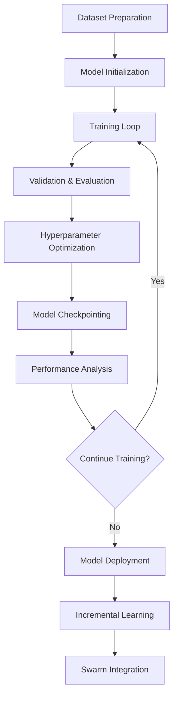

# ML Optimizer Training Strategy for ruv-swarm

## 1. Training Pipeline Overview

The training pipeline for ruv-swarm's ML optimizer is designed to support diverse agent types with specialized neural architectures while maintaining efficient resource usage and continuous improvement capabilities.

### Core Pipeline Components



### Pipeline Architecture

```rust
pub struct TrainingPipeline {
    // Core components
    dataset_manager: DatasetManager,
    model_registry: ModelRegistry,
    training_executor: TrainingExecutor,
    evaluation_framework: EvaluationFramework,
    
    // Optimization components
    hyperparameter_optimizer: HyperparameterOptimizer,
    resource_manager: ResourceManager,
    checkpoint_manager: CheckpointManager,
    
    // Integration layer
    swarm_interface: SwarmIntegrationLayer,
    persistence_layer: PersistenceLayer,
}
```

## 2. Dataset Preparation

### 2.1 Claude Code Stream-JSON Dataset Preparation

#### Stream Event Structure
```rust
#[derive(Serialize, Deserialize)]
pub struct ClaudeCodeStreamEvent {
    pub event_type: StreamEventType,
    pub timestamp: DateTime<Utc>,
    pub content: EventContent,
    pub metadata: EventMetadata,
}

pub enum StreamEventType {
    Thinking,           // Claude's reasoning process
    ToolUse,           // Tool invocation events
    Message,           // Communication with user
    FunctionResult,    // Tool execution results
    Error,             // Error events
    SystemMetadata,    // System-level metadata
}

pub enum EventContent {
    Thinking {
        reasoning_text: String,
        decision_points: Vec<DecisionPoint>,
        context_references: Vec<ContextReference>,
    },
    ToolUse {
        tool_name: String,
        parameters: serde_json::Value,
        purpose: String,
        expected_outcome: Option<String>,
    },
    Message {
        role: MessageRole,
        content: String,
        intent: CommunicationIntent,
    },
    FunctionResult {
        tool_name: String,
        result: serde_json::Value,
        success: bool,
        impact: Option<ImpactAssessment>,
    },
}
```

#### Stream Event Preprocessing Pipeline
```rust
pub struct ClaudeStreamPreprocessor {
    reasoning_extractor: ReasoningSequenceExtractor,
    action_plan_builder: ActionPlanBuilder,
    communication_analyzer: CommunicationPatternAnalyzer,
    performance_tracker: PerformanceSignalExtractor,
}

impl ClaudeStreamPreprocessor {
    pub async fn preprocess_stream(
        &self,
        stream_path: &Path,
    ) -> Result<ProcessedClaudeDataset> {
        // 1. Parse stream-json file
        let events = self.parse_stream_json(stream_path).await?;
        
        // 2. Extract reasoning sequences from thinking events
        let reasoning_sequences = self.reasoning_extractor
            .extract_sequences(&events)
            .await?;
        
        // 3. Transform tool_use events to action plans
        let action_plans = self.action_plan_builder
            .build_from_tool_events(&events)
            .await?;
        
        // 4. Process message events for communication patterns
        let communication_patterns = self.communication_analyzer
            .analyze_messages(&events)
            .await?;
        
        // 5. Extract performance signals
        let performance_signals = self.performance_tracker
            .extract_signals(&events)
            .await?;
        
        Ok(ProcessedClaudeDataset {
            reasoning_sequences,
            action_plans,
            communication_patterns,
            performance_signals,
            raw_events: events,
        })
    }
}

/// Convert thinking events to reasoning sequences
impl ReasoningSequenceExtractor {
    pub async fn extract_sequences(
        &self,
        events: &[ClaudeCodeStreamEvent],
    ) -> Result<Vec<ReasoningSequence>> {
        let mut sequences = Vec::new();
        let mut current_sequence = None;
        
        for event in events {
            match &event.event_type {
                StreamEventType::Thinking => {
                    if let EventContent::Thinking { reasoning_text, decision_points, .. } = &event.content {
                        // Start or continue reasoning sequence
                        match current_sequence.as_mut() {
                            Some(seq) => seq.add_step(reasoning_text, decision_points),
                            None => {
                                current_sequence = Some(ReasoningSequence::new(
                                    reasoning_text.clone(),
                                    decision_points.clone(),
                                    event.timestamp,
                                ));
                            }
                        }
                    }
                },
                StreamEventType::ToolUse | StreamEventType::Message => {
                    // Complete current reasoning sequence
                    if let Some(seq) = current_sequence.take() {
                        sequences.push(seq.finalize(event.timestamp));
                    }
                },
                _ => {}
            }
        }
        
        Ok(sequences)
    }
}

/// Transform tool_use events to action plans
impl ActionPlanBuilder {
    pub async fn build_from_tool_events(
        &self,
        events: &[ClaudeCodeStreamEvent],
    ) -> Result<Vec<ActionPlan>> {
        let mut action_plans = Vec::new();
        let mut current_plan = None;
        
        for (idx, event) in events.iter().enumerate() {
            match &event.event_type {
                StreamEventType::ToolUse => {
                    if let EventContent::ToolUse { tool_name, parameters, purpose, .. } = &event.content {
                        // Check if this is part of a batch operation
                        let is_batch = self.is_batch_operation(events, idx);
                        
                        if is_batch && current_plan.is_none() {
                            current_plan = Some(ActionPlan::new_batch());
                        }
                        
                        let action = ToolAction {
                            tool: tool_name.clone(),
                            parameters: parameters.clone(),
                            purpose: purpose.clone(),
                            timestamp: event.timestamp,
                        };
                        
                        match current_plan.as_mut() {
                            Some(plan) => plan.add_action(action),
                            None => {
                                // Single action plan
                                action_plans.push(ActionPlan::single(action));
                            }
                        }
                    }
                },
                StreamEventType::FunctionResult => {
                    // Complete batch plan if exists
                    if let Some(plan) = current_plan.take() {
                        action_plans.push(plan);
                    }
                },
                _ => {}
            }
        }
        
        Ok(action_plans)
    }
}
```

### 2.2 Coding Task Datasets

#### Dataset Structure
```rust
#[derive(Serialize, Deserialize)]
pub struct CodingTaskDataset {
    pub metadata: DatasetMetadata,
    pub tasks: Vec<CodingTask>,
    pub performance_benchmarks: Vec<PerformanceBenchmark>,
    pub agent_interactions: Vec<AgentInteraction>,
    pub claude_sessions: Vec<ClaudeCodeSession>, // NEW: Real Claude Code sessions
}

#[derive(Serialize, Deserialize)]
pub struct CodingTask {
    pub id: String,
    pub task_type: CodingTaskType,
    pub description: String,
    pub input_code: Option<String>,
    pub expected_output: String,
    pub constraints: Vec<Constraint>,
    pub difficulty_level: DifficultyLevel, // Enhanced with SWE-Bench levels
    pub cognitive_pattern: CognitivePattern,
    pub swe_bench_category: Option<SWEBenchCategory>, // NEW
}

#[derive(Serialize, Deserialize, Clone)]
pub enum DifficultyLevel {
    // SWE-Bench aligned difficulty levels
    Trivial,      // Simple one-line fixes
    Easy,         // Single file, straightforward logic
    Medium,       // Multiple files, moderate complexity
    Hard,         // Complex logic, multiple systems
    Expert,       // Architectural changes, deep understanding required
}

#[derive(Serialize, Deserialize, Clone)]
pub enum SWEBenchCategory {
    BugFix,
    FeatureAddition,
    Refactoring,
    Testing,
    Documentation,
    Performance,
    Security,
}

pub enum CodingTaskType {
    Implementation,
    Optimization,
    Debugging,
    Refactoring,
    Testing,
    Documentation,
    Architecture,
}
```

#### Dataset Sources
1. **Claude Code Stream-JSON**: Extracted from real Claude Code sessions
2. **SWE-Bench Integration**: Tasks categorized by SWE-Bench difficulty
3. **Synthetic Generation**: Automated task generation based on templates
4. **Real-World Projects**: Curated from open-source repositories
5. **User Submissions**: Tasks from swarm operations
6. **Benchmark Suites**: Standard coding challenges and competitions

### 2.3 Training Examples from Real Claude Code Sessions

```rust
#[derive(Serialize, Deserialize)]
pub struct ClaudeCodeSession {
    pub session_id: String,
    pub task_description: String,
    pub stream_events: Vec<ClaudeCodeStreamEvent>,
    pub outcome: SessionOutcome,
    pub performance_metrics: SessionMetrics,
}

pub struct TrainingExampleExtractor {
    pub session_analyzer: SessionAnalyzer,
    pub example_builder: ExampleBuilder,
}

impl TrainingExampleExtractor {
    /// Extract training examples from a Claude Code session
    pub async fn extract_examples(
        &self,
        session: &ClaudeCodeSession,
    ) -> Result<Vec<TrainingExample>> {
        let mut examples = Vec::new();
        
        // 1. Extract reasoning-to-action mappings
        let reasoning_actions = self.extract_reasoning_action_pairs(session)?;
        for (reasoning, action) in reasoning_actions {
            examples.push(TrainingExample::ReasoningToAction {
                input: reasoning.to_training_input(),
                expected_action: action.to_training_output(),
                context: session.get_context_at(&reasoning.timestamp),
            });
        }
        
        // 2. Extract tool selection patterns
        let tool_patterns = self.extract_tool_selection_patterns(session)?;
        for pattern in tool_patterns {
            examples.push(TrainingExample::ToolSelection {
                task_context: pattern.context,
                selected_tool: pattern.tool_name,
                alternatives: pattern.alternative_tools,
                effectiveness: pattern.outcome_score,
            });
        }
        
        // 3. Extract error recovery patterns
        let error_recoveries = self.extract_error_recovery_patterns(session)?;
        for recovery in error_recoveries {
            examples.push(TrainingExample::ErrorRecovery {
                error_context: recovery.error,
                recovery_strategy: recovery.strategy,
                success: recovery.was_successful,
            });
        }
        
        // 4. Extract communication patterns
        let comm_patterns = self.extract_communication_patterns(session)?;
        for pattern in comm_patterns {
            examples.push(TrainingExample::Communication {
                user_query: pattern.user_message,
                response_strategy: pattern.response_approach,
                clarity_score: pattern.effectiveness,
            });
        }
        
        Ok(examples)
    }
}

/// Real-world example: Bug fixing session
pub fn create_bug_fix_training_example() -> TrainingExample {
    TrainingExample::BugFix {
        // From actual Claude Code session fixing a race condition
        initial_code: r#"
            async fn process_tasks(&mut self, tasks: Vec<Task>) {
                for task in tasks {
                    self.queue.push(task);
                    tokio::spawn(async move {
                        self.process_single_task(task).await;
                    });
                }
            }
        "#.to_string(),
        
        reasoning_sequence: vec![
            "The code has a race condition - self is borrowed mutably in the loop",
            "tokio::spawn requires 'static lifetime but self is borrowed",
            "Need to use Arc<Mutex<>> for shared state access",
            "Should also handle task errors properly",
        ],
        
        action_sequence: vec![
            ToolAction::Read { file: "src/processor.rs", lines: (45, 65) },
            ToolAction::Edit { 
                file: "src/processor.rs",
                changes: vec![
                    EditChange::AddImport("use std::sync::{Arc, Mutex};"),
                    EditChange::WrapInArc("self.queue"),
                    EditChange::ClonedForSpawn("queue"),
                ],
            },
            ToolAction::Test { command: "cargo test process_tasks" },
        ],
        
        fixed_code: r#"
            async fn process_tasks(&mut self, tasks: Vec<Task>) {
                let queue = Arc::clone(&self.queue);
                for task in tasks {
                    queue.lock().unwrap().push(task.clone());
                    let task_queue = Arc::clone(&queue);
                    tokio::spawn(async move {
                        if let Err(e) = Self::process_single_task(&task_queue, task).await {
                            eprintln!("Task processing error: {}", e);
                        }
                    });
                }
            }
        "#.to_string(),
        
        difficulty: DifficultyLevel::Medium,
        swe_bench_category: SWEBenchCategory::BugFix,
    }
}
```

### 2.4 Performance Baseline Data

```rust
pub struct PerformanceBaseline {
    pub agent_type: String,
    pub task_type: CodingTaskType,
    pub metrics: BaselineMetrics,
    pub environment_config: EnvironmentConfig,
    pub claude_code_benchmark: Option<ClaudeCodeBenchmark>, // NEW
}

pub struct BaselineMetrics {
    pub execution_time: Duration,
    pub memory_usage: usize,
    pub accuracy_score: f32,
    pub efficiency_rating: f32,
    pub neural_inference_time: Duration,
    pub tool_use_efficiency: f32,      // NEW: How efficiently tools are used
    pub reasoning_depth: f32,          // NEW: Quality of reasoning sequences
    pub error_recovery_rate: f32,      // NEW: Success rate in error recovery
}

pub struct ClaudeCodeBenchmark {
    pub avg_time_to_solution: Duration,
    pub avg_tool_calls: usize,
    pub reasoning_steps: usize,
    pub backtrack_frequency: f32,
    pub success_rate_by_difficulty: HashMap<DifficultyLevel, f32>,
}
```

### 2.5 Performance Signal Extraction

```rust
pub struct PerformanceSignalExtractor {
    signal_processors: Vec<Box<dyn SignalProcessor>>,
    aggregator: SignalAggregator,
}

impl PerformanceSignalExtractor {
    pub async fn extract_signals(
        &self,
        events: &[ClaudeCodeStreamEvent],
    ) -> Result<PerformanceSignals> {
        let mut signals = PerformanceSignals::new();
        
        // 1. Task completion signals
        signals.task_completion = self.extract_completion_signals(events)?;
        
        // 2. Tool usage efficiency
        signals.tool_efficiency = self.analyze_tool_usage(events)?;
        
        // 3. Reasoning quality metrics
        signals.reasoning_quality = self.evaluate_reasoning_quality(events)?;
        
        // 4. Error handling effectiveness
        signals.error_handling = self.analyze_error_patterns(events)?;
        
        // 5. Time-based performance
        signals.temporal_metrics = self.calculate_temporal_metrics(events)?;
        
        Ok(signals)
    }
    
    fn analyze_tool_usage(&self, events: &[ClaudeCodeStreamEvent]) -> Result<ToolEfficiencyMetrics> {
        let mut metrics = ToolEfficiencyMetrics::default();
        let mut tool_sequences = Vec::new();
        let mut current_sequence = Vec::new();
        
        for event in events {
            match &event.event_type {
                StreamEventType::ToolUse => {
                    if let EventContent::ToolUse { tool_name, .. } = &event.content {
                        current_sequence.push(tool_name.clone());
                    }
                },
                StreamEventType::FunctionResult => {
                    if let EventContent::FunctionResult { success, .. } = &event.content {
                        if *success && !current_sequence.is_empty() {
                            tool_sequences.push(current_sequence.clone());
                            current_sequence.clear();
                        }
                    }
                },
                _ => {}
            }
        }
        
        // Calculate efficiency metrics
        metrics.redundant_calls = self.count_redundant_calls(&tool_sequences);
        metrics.batch_utilization = self.calculate_batch_utilization(&tool_sequences);
        metrics.optimal_path_ratio = self.calculate_optimal_path_ratio(&tool_sequences);
        
        Ok(metrics)
    }
    
    fn evaluate_reasoning_quality(&self, events: &[ClaudeCodeStreamEvent]) -> Result<ReasoningQualityMetrics> {
        let thinking_events: Vec<_> = events.iter()
            .filter(|e| matches!(e.event_type, StreamEventType::Thinking))
            .collect();
        
        Ok(ReasoningQualityMetrics {
            avg_reasoning_depth: self.calculate_reasoning_depth(&thinking_events),
            decision_accuracy: self.evaluate_decision_accuracy(&thinking_events),
            context_awareness: self.measure_context_awareness(&thinking_events),
            logical_coherence: self.assess_logical_coherence(&thinking_events),
        })
    }
}

#[derive(Default)]
pub struct PerformanceSignals {
    pub task_completion: TaskCompletionMetrics,
    pub tool_efficiency: ToolEfficiencyMetrics,
    pub reasoning_quality: ReasoningQualityMetrics,
    pub error_handling: ErrorHandlingMetrics,
    pub temporal_metrics: TemporalMetrics,
}
```

### 2.6 Swarm Interaction Patterns

```rust
pub struct SwarmInteractionPattern {
    pub pattern_id: String,
    pub participant_agents: Vec<AgentProfile>,
    pub interaction_type: InteractionType,
    pub communication_flow: Vec<Message>,
    pub coordination_strategy: CoordinationStrategy,
    pub outcome_metrics: OutcomeMetrics,
}

pub enum InteractionType {
    Collaborative,      // Agents working together
    Competitive,       // Agents competing for resources
    Hierarchical,      // Manager-worker relationships
    PeerToPeer,       // Equal collaboration
    Specialized,      // Task delegation by expertise
}
```

### Dataset Preprocessing Pipeline

```rust
impl DatasetPreprocessor {
    pub async fn prepare_training_data(&self) -> Result<ProcessedDataset> {
        // 1. Load raw datasets
        let raw_data = self.load_raw_datasets().await?;
        
        // 2. Clean and normalize
        let cleaned_data = self.clean_and_normalize(raw_data)?;
        
        // 3. Feature extraction
        let features = self.extract_features(cleaned_data)?;
        
        // 4. Data augmentation
        let augmented_data = self.augment_dataset(features)?;
        
        // 5. Split into train/val/test
        let splits = self.create_splits(augmented_data, 
            TrainSplit(0.7), 
            ValSplit(0.15), 
            TestSplit(0.15)
        )?;
        
        // 6. Create batches
        let batched_data = self.create_batches(splits)?;
        
        Ok(ProcessedDataset {
            training_batches: batched_data.train,
            validation_batches: batched_data.val,
            test_batches: batched_data.test,
            metadata: self.generate_metadata(),
        })
    }
}
```

## 3. Training Approaches for Different Models

### 3.1 Curriculum Learning with SWE-Bench Difficulty Levels

```rust
pub struct CurriculumLearningStrategy {
    difficulty_scheduler: DifficultyScheduler,
    performance_tracker: PerformanceTracker,
    dataset_manager: SWEBenchDatasetManager,
}

impl CurriculumLearningStrategy {
    pub async fn train_with_curriculum(
        &mut self,
        model: &mut TrainableModel,
        full_dataset: &SWEBenchDataset,
    ) -> Result<CurriculumTrainingResults> {
        let mut results = CurriculumTrainingResults::new();
        
        // Start with trivial tasks
        let difficulty_progression = vec![
            DifficultyLevel::Trivial,
            DifficultyLevel::Easy,
            DifficultyLevel::Medium,
            DifficultyLevel::Hard,
            DifficultyLevel::Expert,
        ];
        
        for difficulty in difficulty_progression {
            println!("Training on {} level tasks", difficulty);
            
            // Get tasks for current difficulty
            let current_tasks = full_dataset.filter_by_difficulty(difficulty);
            
            // Create training batches
            let batches = self.create_balanced_batches(&current_tasks)?;
            
            // Train on current difficulty
            let stage_results = self.train_difficulty_stage(
                model,
                &batches,
                difficulty,
            ).await?;
            
            results.stage_results.insert(difficulty, stage_results);
            
            // Check if model is ready for next difficulty
            if !self.is_ready_for_next_level(&stage_results, difficulty) {
                // Continue training on current level
                let additional_results = self.remedial_training(
                    model,
                    &current_tasks,
                    difficulty,
                ).await?;
                results.remedial_stages.push(additional_results);
            }
            
            // Optionally mix in previous difficulties for retention
            if difficulty != DifficultyLevel::Trivial {
                let retention_batch = self.create_retention_batch(
                    full_dataset,
                    &difficulty_progression[..difficulty_progression.iter().position(|&d| d == difficulty).unwrap()]
                )?;
                
                self.retention_training(model, &retention_batch).await?;
            }
        }
        
        Ok(results)
    }
    
    async fn train_difficulty_stage(
        &mut self,
        model: &mut TrainableModel,
        batches: &[TrainingBatch],
        difficulty: DifficultyLevel,
    ) -> Result<StageResults> {
        let mut stage_metrics = StageResults::new(difficulty);
        
        // Adjust training parameters based on difficulty
        let training_config = self.get_difficulty_config(difficulty);
        model.set_training_config(training_config);
        
        for epoch in 0..training_config.max_epochs {
            let mut epoch_loss = 0.0;
            let mut correct_predictions = 0;
            let mut total_predictions = 0;
            
            for batch in batches {
                // Forward pass
                let outputs = model.forward(&batch.inputs)?;
                
                // Calculate loss with difficulty-weighted importance
                let loss = self.calculate_weighted_loss(
                    &outputs,
                    &batch.targets,
                    difficulty,
                )?;
                
                // Backward pass
                model.backward(&loss)?;
                
                // Track metrics
                epoch_loss += loss.value();
                let (correct, total) = self.calculate_accuracy(&outputs, &batch.targets);
                correct_predictions += correct;
                total_predictions += total;
            }
            
            let accuracy = correct_predictions as f32 / total_predictions as f32;
            stage_metrics.add_epoch_metrics(epoch, epoch_loss, accuracy);
            
            // Early graduation if performing well
            if accuracy > self.get_graduation_threshold(difficulty) {
                stage_metrics.graduated_early = true;
                break;
            }
        }
        
        Ok(stage_metrics)
    }
    
    fn get_difficulty_config(&self, difficulty: DifficultyLevel) -> TrainingConfig {
        match difficulty {
            DifficultyLevel::Trivial => TrainingConfig {
                learning_rate: 1e-3,
                batch_size: 64,
                max_epochs: 10,
                patience: 3,
                ..Default::default()
            },
            DifficultyLevel::Easy => TrainingConfig {
                learning_rate: 5e-4,
                batch_size: 32,
                max_epochs: 20,
                patience: 5,
                ..Default::default()
            },
            DifficultyLevel::Medium => TrainingConfig {
                learning_rate: 1e-4,
                batch_size: 16,
                max_epochs: 30,
                patience: 7,
                gradient_clipping: Some(1.0),
                ..Default::default()
            },
            DifficultyLevel::Hard => TrainingConfig {
                learning_rate: 5e-5,
                batch_size: 8,
                max_epochs: 50,
                patience: 10,
                gradient_clipping: Some(0.5),
                dropout_rate: 0.3,
                ..Default::default()
            },
            DifficultyLevel::Expert => TrainingConfig {
                learning_rate: 1e-5,
                batch_size: 4,
                max_epochs: 100,
                patience: 15,
                gradient_clipping: Some(0.1),
                dropout_rate: 0.5,
                use_gradient_accumulation: true,
                accumulation_steps: 4,
                ..Default::default()
            },
        }
    }
}
```

### 3.2 Supervised Learning Strategies

#### Neural Network Training for Agent Specialization
```rust
pub struct SupervisedTrainer {
    network: Network<f32>,
    training_algorithm: TrainingAlgorithm,
    loss_function: LossFunction,
    optimizer: Optimizer,
    curriculum_manager: Option<CurriculumLearningStrategy>, // NEW
}

impl SupervisedTrainer {
    pub async fn train_agent_network(
        &mut self,
        agent_type: AgentType,
        dataset: &ProcessedDataset,
    ) -> Result<TrainingResults> {
        // Configure network for specific agent type
        self.configure_for_agent_type(agent_type)?;
        
        // Training loop
        for epoch in 0..self.config.max_epochs {
            let mut epoch_loss = 0.0;
            
            for batch in dataset.training_batches.iter() {
                // Forward pass
                let predictions = self.network.forward(batch.inputs)?;
                
                // Calculate loss
                let loss = self.loss_function.calculate(
                    &predictions, 
                    &batch.targets
                )?;
                
                // Backward pass
                let gradients = self.network.backward(&loss)?;
                
                // Update weights
                self.optimizer.update_weights(
                    &mut self.network, 
                    &gradients
                )?;
                
                epoch_loss += loss.value();
            }
            
            // Validation
            let val_metrics = self.validate(dataset.validation_batches)?;
            
            // Early stopping check
            if self.should_stop_early(&val_metrics) {
                break;
            }
        }
        
        Ok(self.generate_results())
    }
}
```

### 3.2 Reinforcement Learning for Swarm Coordination

```rust
pub struct SwarmCoordinationRL {
    policy_network: PolicyNetwork,
    value_network: ValueNetwork,
    experience_buffer: ExperienceReplayBuffer,
    environment: SwarmEnvironment,
}

impl SwarmCoordinationRL {
    pub async fn train_coordination_policy(&mut self) -> Result<PolicyModel> {
        // PPO (Proximal Policy Optimization) for stable multi-agent learning
        let ppo_config = PPOConfig {
            clip_ratio: 0.2,
            value_loss_coef: 0.5,
            entropy_coef: 0.01,
            learning_rate: 3e-4,
            batch_size: 64,
            n_epochs: 10,
        };
        
        for iteration in 0..self.config.max_iterations {
            // Collect trajectories
            let trajectories = self.collect_trajectories(
                self.config.n_steps
            ).await?;
            
            // Calculate advantages
            let advantages = self.calculate_gae(
                &trajectories,
                self.config.gamma,
                self.config.lambda
            )?;
            
            // Update policy and value networks
            for epoch in 0..ppo_config.n_epochs {
                for batch in trajectories.create_batches(ppo_config.batch_size) {
                    // Policy loss
                    let policy_loss = self.calculate_ppo_loss(
                        &batch,
                        &advantages,
                        ppo_config.clip_ratio
                    )?;
                    
                    // Value loss
                    let value_loss = self.calculate_value_loss(&batch)?;
                    
                    // Total loss with entropy bonus
                    let total_loss = policy_loss 
                        + ppo_config.value_loss_coef * value_loss
                        - ppo_config.entropy_coef * self.calculate_entropy(&batch)?;
                    
                    // Update networks
                    self.optimizer.minimize(&total_loss)?;
                }
            }
            
            // Evaluate performance
            let metrics = self.evaluate_swarm_performance().await?;
            
            if metrics.coordination_score > self.config.target_score {
                break;
            }
        }
        
        Ok(self.export_policy_model())
    }
}
```

### 3.3 Transfer Learning from Existing Models

```rust
pub struct TransferLearningManager {
    pretrained_models: HashMap<String, PretrainedModel>,
    adaptation_strategies: HashMap<AgentType, AdaptationStrategy>,
}

impl TransferLearningManager {
    pub async fn adapt_pretrained_model(
        &self,
        source_model: &PretrainedModel,
        target_agent_type: AgentType,
        fine_tuning_data: &Dataset,
    ) -> Result<AdaptedModel> {
        // 1. Load pretrained weights
        let base_network = source_model.load_network()?;
        
        // 2. Freeze early layers
        let frozen_layers = self.determine_frozen_layers(
            &base_network,
            target_agent_type
        )?;
        
        // 3. Add task-specific layers
        let adapted_network = self.add_task_specific_layers(
            base_network,
            target_agent_type
        )?;
        
        // 4. Fine-tune on target data
        let fine_tuner = FineTuner::new(
            adapted_network,
            FinetuneConfig {
                learning_rate: 1e-4, // Lower LR for fine-tuning
                frozen_layers,
                regularization: L2Regularization(0.001),
            }
        );
        
        let fine_tuned_model = fine_tuner.train(
            fine_tuning_data,
            self.config.fine_tune_epochs
        ).await?;
        
        Ok(AdaptedModel {
            base_model_id: source_model.id.clone(),
            adapted_for: target_agent_type,
            network: fine_tuned_model,
            performance_metrics: self.evaluate_adaptation(&fine_tuned_model)?,
        })
    }
}
```

## 4. Hyperparameter Optimization Strategy

### 4.1 Bayesian Optimization Framework

```rust
pub struct BayesianHyperparameterOptimizer {
    search_space: HyperparameterSpace,
    acquisition_function: AcquisitionFunction,
    gaussian_process: GaussianProcess,
    optimization_history: Vec<Trial>,
}

impl BayesianHyperparameterOptimizer {
    pub async fn optimize(
        &mut self,
        objective_function: impl Fn(Hyperparameters) -> f32,
        n_trials: usize,
    ) -> Result<OptimalHyperparameters> {
        // Initialize with random trials
        for _ in 0..self.config.n_initial_points {
            let params = self.search_space.sample_random();
            let score = objective_function(params.clone());
            self.optimization_history.push(Trial { params, score });
        }
        
        // Bayesian optimization loop
        for trial in self.config.n_initial_points..n_trials {
            // Update Gaussian Process with observations
            self.gaussian_process.fit(&self.optimization_history)?;
            
            // Find next point to evaluate
            let next_params = self.maximize_acquisition_function()?;
            
            // Evaluate objective
            let score = objective_function(next_params.clone());
            
            // Update history
            self.optimization_history.push(Trial { 
                params: next_params, 
                score 
            });
            
            // Early stopping if converged
            if self.has_converged() {
                break;
            }
        }
        
        Ok(self.get_best_hyperparameters())
    }
}
```

### 4.2 Multi-Objective Optimization

```rust
pub struct MultiObjectiveOptimizer {
    objectives: Vec<ObjectiveFunction>,
    pareto_frontier: ParetoFrontier,
}

impl MultiObjectiveOptimizer {
    pub async fn optimize_multi_objective(
        &mut self,
        hyperparameter_ranges: HyperparameterRanges,
    ) -> Result<Vec<ParetoOptimalSolution>> {
        // NSGA-II algorithm for multi-objective optimization
        let mut population = self.initialize_population(
            self.config.population_size
        );
        
        for generation in 0..self.config.n_generations {
            // Evaluate objectives for each individual
            for individual in population.iter_mut() {
                individual.objectives = self.evaluate_objectives(
                    &individual.hyperparameters
                ).await?;
            }
            
            // Non-dominated sorting
            let fronts = self.non_dominated_sort(&population);
            
            // Crowding distance assignment
            self.assign_crowding_distance(&mut fronts);
            
            // Selection, crossover, and mutation
            let offspring = self.generate_offspring(&population)?;
            
            // Environmental selection
            population = self.environmental_selection(
                population,
                offspring,
                self.config.population_size
            )?;
            
            // Update Pareto frontier
            self.pareto_frontier.update(&population);
        }
        
        Ok(self.pareto_frontier.get_solutions())
    }
}
```

### 4.3 Hyperparameter Search Space

```rust
pub struct HyperparameterSpace {
    // Neural network architecture
    pub hidden_layers: RangeParameter<usize>,
    pub neurons_per_layer: RangeParameter<usize>,
    pub activation_functions: CategoricalParameter<ActivationFunction>,
    pub connection_rate: ContinuousParameter<f32>,
    
    // Training parameters
    pub learning_rate: LogUniformParameter<f32>,
    pub batch_size: ChoiceParameter<usize>,
    pub optimizer: CategoricalParameter<OptimizerType>,
    pub dropout_rate: ContinuousParameter<f32>,
    
    // Regularization
    pub l1_regularization: LogUniformParameter<f32>,
    pub l2_regularization: LogUniformParameter<f32>,
    pub weight_decay: LogUniformParameter<f32>,
    
    // Agent-specific parameters
    pub cognitive_pattern_weight: ContinuousParameter<f32>,
    pub specialization_factor: ContinuousParameter<f32>,
}
```

## 5. Cross-validation and Evaluation Methods

### 5.1 K-Fold Cross-Validation

```rust
pub struct KFoldCrossValidator {
    k: usize,
    stratified: bool,
    shuffle: bool,
    random_seed: u64,
}

impl KFoldCrossValidator {
    pub async fn validate<M: Trainable>(
        &self,
        model_builder: impl Fn() -> M,
        dataset: &Dataset,
        metrics: &[MetricType],
    ) -> Result<CrossValidationResults> {
        let folds = self.create_folds(dataset)?;
        let mut fold_results = Vec::new();
        
        for (fold_idx, (train_indices, val_indices)) in folds.iter().enumerate() {
            // Create fold datasets
            let train_data = dataset.subset(train_indices);
            let val_data = dataset.subset(val_indices);
            
            // Train model on fold
            let mut model = model_builder();
            model.train(&train_data).await?;
            
            // Evaluate on validation fold
            let fold_metrics = self.evaluate_model(
                &model,
                &val_data,
                metrics
            ).await?;
            
            fold_results.push(FoldResult {
                fold_index: fold_idx,
                metrics: fold_metrics,
                model_checkpoint: model.checkpoint()?,
            });
        }
        
        Ok(CrossValidationResults {
            fold_results,
            aggregate_metrics: self.aggregate_metrics(&fold_results),
            confidence_intervals: self.calculate_confidence_intervals(&fold_results),
        })
    }
}
```

### 5.2 Time Series Cross-Validation

```rust
pub struct TimeSeriesCrossValidator {
    window_size: usize,
    step_size: usize,
    gap: usize, // Gap between train and test
}

impl TimeSeriesCrossValidator {
    pub async fn validate_time_series(
        &self,
        model: &mut impl TimeSeriesModel,
        time_series_data: &TimeSeriesDataset,
    ) -> Result<TimeSeriesValidationResults> {
        let mut results = Vec::new();
        
        let splits = self.create_time_splits(time_series_data)?;
        
        for (train_window, test_window) in splits {
            // Train on historical data
            model.fit(&train_window).await?;
            
            // Predict future values
            let predictions = model.predict(test_window.len()).await?;
            
            // Calculate time series specific metrics
            let metrics = TimeSeriesMetrics {
                mse: self.calculate_mse(&predictions, &test_window),
                mae: self.calculate_mae(&predictions, &test_window),
                mape: self.calculate_mape(&predictions, &test_window),
                directional_accuracy: self.calculate_da(&predictions, &test_window),
            };
            
            results.push(metrics);
        }
        
        Ok(TimeSeriesValidationResults {
            window_metrics: results,
            aggregate_performance: self.aggregate_time_series_metrics(&results),
        })
    }
}
```

### 5.3 Agent-Specific Evaluation Metrics

```rust
pub struct AgentEvaluationFramework {
    cognitive_evaluator: CognitivePatternEvaluator,
    task_performance_evaluator: TaskPerformanceEvaluator,
    swarm_contribution_evaluator: SwarmContributionEvaluator,
}

impl AgentEvaluationFramework {
    pub async fn evaluate_agent(
        &self,
        agent: &Agent,
        evaluation_tasks: &[EvaluationTask],
    ) -> Result<AgentEvaluationReport> {
        let mut report = AgentEvaluationReport::new(agent.id());
        
        // 1. Cognitive pattern alignment
        report.cognitive_alignment = self.cognitive_evaluator
            .evaluate_pattern_alignment(agent)
            .await?;
        
        // 2. Task-specific performance
        for task in evaluation_tasks {
            let performance = self.task_performance_evaluator
                .evaluate_task_performance(agent, task)
                .await?;
            report.task_performances.push(performance);
        }
        
        // 3. Swarm contribution metrics
        report.swarm_contribution = self.swarm_contribution_evaluator
            .evaluate_contribution(agent)
            .await?;
        
        // 4. Resource efficiency
        report.resource_efficiency = ResourceEfficiencyMetrics {
            memory_usage: agent.get_memory_usage(),
            compute_time: agent.get_average_compute_time(),
            neural_inference_speed: agent.get_inference_speed(),
        };
        
        Ok(report)
    }
}
```

## 6. Incremental Training for Continuous Improvement

### 6.1 Stream-Based Online Learning Pipeline

```rust
pub struct StreamBasedOnlineLearning {
    model: AdaptiveNeuralNetwork,
    stream_processor: ClaudeStreamProcessor,
    experience_buffer: PrioritizedExperienceBuffer,
    update_strategy: AdaptiveUpdateStrategy,
    drift_detector: ConceptDriftDetector,
    performance_monitor: RealTimePerformanceMonitor,
}

impl StreamBasedOnlineLearning {
    /// Process Claude Code stream events in real-time for online learning
    pub async fn process_claude_stream(
        &mut self,
        stream_reader: &mut StreamReader,
    ) -> Result<StreamLearningResults> {
        let mut results = StreamLearningResults::new();
        let mut event_window = EventWindow::new(self.config.window_size);
        
        while let Some(event) = stream_reader.next_event().await? {
            // Add to sliding window
            event_window.push(event.clone());
            
            // Process event based on type
            match event.event_type {
                StreamEventType::Thinking => {
                    let reasoning_features = self.extract_reasoning_features(&event)?;
                    self.experience_buffer.add_reasoning_experience(
                        reasoning_features,
                        self.calculate_reasoning_priority(&event)
                    );
                },
                
                StreamEventType::ToolUse => {
                    // Wait for result to create complete experience
                    if let Some(result) = stream_reader.peek_next_result().await? {
                        let action_experience = self.create_action_experience(
                            &event,
                            &result,
                            &event_window
                        )?;
                        self.experience_buffer.add_action_experience(action_experience);
                    }
                },
                
                StreamEventType::FunctionResult => {
                    // Extract performance signals
                    let signals = self.extract_performance_signals(&event, &event_window)?;
                    results.performance_signals.push(signals);
                    
                    // Check if batch update should occur
                    if self.should_update_model(&event_window) {
                        let update_result = self.perform_stream_update().await?;
                        results.updates.push(update_result);
                    }
                },
                
                StreamEventType::Error => {
                    // Learn from errors
                    let error_experience = self.create_error_experience(&event, &event_window)?;
                    self.experience_buffer.add_high_priority(error_experience);
                },
                
                _ => {}
            }
            
            // Periodic model evaluation
            if self.should_evaluate() {
                let eval_metrics = self.evaluate_online_performance().await?;
                results.evaluations.push(eval_metrics);
            }
        }
        
        Ok(results)
    }
    
    async fn perform_stream_update(&mut self) -> Result<StreamUpdateResult> {
        // Sample high-value experiences
        let batch = self.experience_buffer.sample_prioritized(
            self.config.batch_size,
            self.config.priority_exponent
        );
        
        // Prepare training data from experiences
        let training_batch = self.prepare_training_batch(&batch)?;
        
        // Save current model state for potential rollback
        let checkpoint = self.model.create_checkpoint();
        
        // Perform incremental update
        let update_metrics = self.model.incremental_update(&training_batch).await?;
        
        // Validate update on recent stream data
        let validation_score = self.validate_on_recent_stream(&checkpoint).await?;
        
        if validation_score.is_improvement() {
            // Keep update and adjust priorities
            for (idx, td_error) in update_metrics.td_errors.iter().enumerate() {
                self.experience_buffer.update_priority(
                    batch.indices[idx],
                    td_error.abs()
                );
            }
            
            Ok(StreamUpdateResult::Success {
                improvement: validation_score.improvement_percentage,
                samples_used: batch.len(),
                update_metrics,
            })
        } else {
            // Rollback to checkpoint
            self.model.restore_checkpoint(checkpoint);
            
            Ok(StreamUpdateResult::Rollback {
                reason: "Validation score decreased".to_string(),
                attempted_samples: batch.len(),
            })
        }
    }
    
    fn extract_reasoning_features(&self, event: &ClaudeCodeStreamEvent) -> Result<ReasoningFeatures> {
        if let EventContent::Thinking { reasoning_text, decision_points, context_references } = &event.content {
            Ok(ReasoningFeatures {
                text_embedding: self.embed_reasoning_text(reasoning_text)?,
                decision_complexity: decision_points.len() as f32,
                context_depth: self.calculate_context_depth(context_references),
                timestamp: event.timestamp,
            })
        } else {
            Err(Error::InvalidEventType)
        }
    }
    
    fn create_action_experience(
        &self,
        tool_event: &ClaudeCodeStreamEvent,
        result_event: &ClaudeCodeStreamEvent,
        window: &EventWindow,
    ) -> Result<ActionExperience> {
        let prior_reasoning = window.get_prior_reasoning(tool_event.timestamp)?;
        let tool_params = self.extract_tool_parameters(tool_event)?;
        let outcome = self.evaluate_outcome(result_event)?;
        
        Ok(ActionExperience {
            state: self.encode_state(window, tool_event.timestamp)?,
            action: self.encode_action(&tool_params)?,
            reward: self.calculate_reward(&outcome)?,
            next_state: self.encode_state(window, result_event.timestamp)?,
            metadata: ActionMetadata {
                tool_name: tool_params.tool_name,
                success: outcome.success,
                execution_time: result_event.timestamp - tool_event.timestamp,
                reasoning_steps: prior_reasoning.len(),
            },
        })
    }
}

/// Configuration for stream-based learning
pub struct StreamLearningConfig {
    pub window_size: usize,              // Size of event window for context
    pub batch_size: usize,               // Batch size for updates
    pub update_frequency: Duration,      // How often to attempt updates
    pub priority_exponent: f32,          // For prioritized sampling
    pub validation_window: usize,        // Number of recent events for validation
    pub min_experiences: usize,          // Minimum experiences before first update
    pub drift_threshold: f32,            // Threshold for concept drift detection
}
```

### 6.2 Online Learning Pipeline

```rust
pub struct OnlineLearningPipeline {
    model: AdaptiveNeuralNetwork,
    experience_buffer: ExperienceBuffer,
    update_strategy: UpdateStrategy,
    drift_detector: ConceptDriftDetector,
    stream_learner: Option<StreamBasedOnlineLearning>, // NEW: Stream-based learning
}

impl OnlineLearningPipeline {
    pub async fn process_new_experience(
        &mut self,
        experience: Experience,
    ) -> Result<UpdateResult> {
        // Add to experience buffer
        self.experience_buffer.add(experience.clone());
        
        // Check for concept drift
        if let Some(drift) = self.drift_detector.detect_drift(&experience)? {
            self.handle_concept_drift(drift).await?;
        }
        
        // Determine if update is needed
        if self.update_strategy.should_update(&self.experience_buffer) {
            // Create mini-batch from recent experiences
            let batch = self.experience_buffer.sample_recent(
                self.config.online_batch_size
            );
            
            // Perform incremental update
            let update_result = self.model.incremental_update(&batch).await?;
            
            // Validate update didn't degrade performance
            if self.validate_update(&update_result)? {
                self.model.commit_update();
            } else {
                self.model.rollback_update();
            }
            
            return Ok(update_result);
        }
        
        Ok(UpdateResult::Skipped)
    }
    
    /// Process Claude Code stream for online learning
    pub async fn process_claude_stream(
        &mut self,
        stream_path: &Path,
    ) -> Result<StreamLearningResults> {
        if let Some(stream_learner) = &mut self.stream_learner {
            let mut reader = StreamReader::new(stream_path)?;
            stream_learner.process_claude_stream(&mut reader).await
        } else {
            Err(Error::StreamLearnerNotConfigured)
        }
    }
}
```

### 6.2 Experience Replay Management

```rust
pub struct PrioritizedExperienceReplay {
    buffer: SegmentTree<Experience>,
    priority_calculator: PriorityCalculator,
    max_size: usize,
}

impl PrioritizedExperienceReplay {
    pub fn add_experience(&mut self, experience: Experience) {
        let priority = self.priority_calculator.calculate(&experience);
        
        if self.buffer.len() >= self.max_size {
            // Remove lowest priority experience
            self.buffer.remove_min();
        }
        
        self.buffer.insert(experience, priority);
    }
    
    pub fn sample_batch(
        &self,
        batch_size: usize,
        beta: f32, // Importance sampling parameter
    ) -> SampledBatch {
        let mut batch = Vec::with_capacity(batch_size);
        let mut weights = Vec::with_capacity(batch_size);
        
        let total_priority = self.buffer.total_priority();
        
        for _ in 0..batch_size {
            let sample = self.buffer.sample_proportional();
            
            // Calculate importance sampling weight
            let prob = sample.priority / total_priority;
            let weight = (self.buffer.len() as f32 * prob).powf(-beta);
            
            batch.push(sample.experience);
            weights.push(weight);
        }
        
        // Normalize weights
        let max_weight = weights.iter().max_by(|a, b| a.partial_cmp(b).unwrap())
            .unwrap_or(&1.0);
        weights.iter_mut().for_each(|w| *w /= max_weight);
        
        SampledBatch { experiences: batch, importance_weights: weights }
    }
}
```

### 6.3 Continuous Learning Strategies

```rust
pub enum ContinuousLearningStrategy {
    // Elastic Weight Consolidation
    EWC {
        fisher_information: FisherInformationMatrix,
        importance_weight: f32,
    },
    
    // Progressive Neural Networks
    Progressive {
        frozen_columns: Vec<NetworkColumn>,
        lateral_connections: Vec<LateralConnection>,
    },
    
    // Dynamic Architecture
    DynamicExpansion {
        growth_criterion: GrowthCriterion,
        pruning_strategy: PruningStrategy,
    },
    
    // Memory-based approaches
    Rehearsal {
        memory_buffer: MemoryBuffer,
        generation_model: Option<GenerativeModel>,
    },
}

impl ContinuousLearningStrategy {
    pub async fn update_with_new_task(
        &mut self,
        model: &mut AdaptiveModel,
        new_task_data: &TaskData,
    ) -> Result<()> {
        match self {
            Self::EWC { fisher_information, importance_weight } => {
                // Calculate Fisher Information for important weights
                let new_fisher = calculate_fisher_information(model, new_task_data)?;
                
                // Merge with existing Fisher Information
                fisher_information.merge(&new_fisher);
                
                // Train with EWC regularization
                train_with_ewc(
                    model,
                    new_task_data,
                    fisher_information,
                    *importance_weight
                ).await
            },
            
            Self::Progressive { frozen_columns, lateral_connections } => {
                // Freeze existing columns
                let frozen_model = model.freeze_current_state()?;
                frozen_columns.push(frozen_model);
                
                // Add new column for new task
                let new_column = NetworkColumn::new_for_task(new_task_data);
                
                // Create lateral connections
                let new_connections = create_lateral_connections(
                    &frozen_columns,
                    &new_column
                )?;
                lateral_connections.extend(new_connections);
                
                // Train new column
                train_progressive_column(new_column, new_task_data).await
            },
            
            // Other strategies...
            _ => unimplemented!()
        }
    }
}
```

## 7. Resource Management during Training

### 7.1 Memory Management

```rust
pub struct TrainingMemoryManager {
    memory_pool: MemoryPool,
    gradient_cache: GradientCache,
    activation_cache: ActivationCache,
    model_cache: ModelCache,
}

impl TrainingMemoryManager {
    pub async fn allocate_training_resources(
        &mut self,
        model_size: usize,
        batch_size: usize,
    ) -> Result<TrainingResources> {
        // Calculate memory requirements
        let memory_requirements = self.calculate_memory_requirements(
            model_size,
            batch_size
        )?;
        
        // Check available memory
        let available_memory = self.memory_pool.available_memory();
        
        if memory_requirements.total > available_memory {
            // Implement memory optimization strategies
            self.optimize_memory_usage(memory_requirements, available_memory)?;
        }
        
        // Allocate memory pools
        let resources = TrainingResources {
            model_memory: self.memory_pool.allocate(memory_requirements.model)?,
            gradient_memory: self.memory_pool.allocate(memory_requirements.gradients)?,
            activation_memory: self.memory_pool.allocate(memory_requirements.activations)?,
            batch_memory: self.memory_pool.allocate(memory_requirements.batch_data)?,
        };
        
        Ok(resources)
    }
    
    pub fn optimize_memory_usage(
        &mut self,
        requirements: MemoryRequirements,
        available: usize,
    ) -> Result<()> {
        // 1. Enable gradient checkpointing
        if requirements.gradients > available * 0.3 {
            self.enable_gradient_checkpointing()?;
        }
        
        // 2. Reduce batch size if needed
        if requirements.batch_data > available * 0.2 {
            self.reduce_batch_size()?;
        }
        
        // 3. Use mixed precision training
        if requirements.total > available * 0.8 {
            self.enable_mixed_precision()?;
        }
        
        // 4. Implement gradient accumulation
        if requirements.gradients > available * 0.4 {
            self.enable_gradient_accumulation(4)?; // Accumulate over 4 steps
        }
        
        Ok(())
    }
}
```

### 7.2 Compute Resource Optimization

```rust
pub struct ComputeResourceOptimizer {
    gpu_manager: GPUManager,
    cpu_thread_pool: ThreadPool,
    task_scheduler: TaskScheduler,
}

impl ComputeResourceOptimizer {
    pub async fn optimize_training_compute(
        &mut self,
        training_config: &TrainingConfig,
    ) -> Result<ComputeStrategy> {
        // Detect available resources
        let resources = self.detect_resources()?;
        
        let strategy = match resources {
            Resources::MultiGPU(gpus) => {
                // Data parallel training across GPUs
                ComputeStrategy::DataParallel {
                    devices: gpus,
                    batch_per_device: training_config.batch_size / gpus.len(),
                    gradient_aggregation: GradientAggregation::AllReduce,
                }
            },
            
            Resources::SingleGPU(gpu) => {
                // Optimize for single GPU
                ComputeStrategy::SingleDevice {
                    device: gpu,
                    mixed_precision: true,
                    tensor_cores: gpu.has_tensor_cores(),
                }
            },
            
            Resources::CPUOnly(cores) => {
                // CPU optimization with SIMD
                ComputeStrategy::CPU {
                    num_threads: cores,
                    simd_enabled: true,
                    cache_optimization: true,
                }
            },
        };
        
        Ok(strategy)
    }
}
```

### 7.3 Distributed Training Support

```rust
pub struct DistributedTrainingManager {
    communication_backend: CommunicationBackend,
    worker_nodes: Vec<WorkerNode>,
    parameter_server: Option<ParameterServer>,
}

impl DistributedTrainingManager {
    pub async fn setup_distributed_training(
        &mut self,
        world_size: usize,
        rank: usize,
    ) -> Result<DistributedContext> {
        // Initialize communication backend
        self.communication_backend.init(world_size, rank)?;
        
        // Setup based on training paradigm
        let context = match self.config.paradigm {
            DistributedParadigm::DataParallel => {
                self.setup_data_parallel(world_size, rank).await?
            },
            
            DistributedParadigm::ModelParallel => {
                self.setup_model_parallel(world_size, rank).await?
            },
            
            DistributedParadigm::Pipeline => {
                self.setup_pipeline_parallel(world_size, rank).await?
            },
            
            DistributedParadigm::Hybrid => {
                self.setup_hybrid_parallel(world_size, rank).await?
            },
        };
        
        Ok(context)
    }
    
    pub async fn synchronize_gradients(
        &self,
        local_gradients: &Gradients,
    ) -> Result<Gradients> {
        match self.config.reduction_op {
            ReductionOp::Sum => {
                self.communication_backend.all_reduce_sum(local_gradients).await
            },
            ReductionOp::Average => {
                let sum = self.communication_backend.all_reduce_sum(local_gradients).await?;
                Ok(sum / self.world_size as f32)
            },
        }
    }
}
```

## 8. Model Checkpointing and Versioning

### 8.1 Checkpoint Management System

```rust
pub struct CheckpointManager {
    storage_backend: StorageBackend,
    versioning_system: VersioningSystem,
    checkpoint_strategy: CheckpointStrategy,
}

impl CheckpointManager {
    pub async fn save_checkpoint(
        &self,
        model: &Model,
        training_state: &TrainingState,
        metadata: CheckpointMetadata,
    ) -> Result<CheckpointId> {
        // Create checkpoint data
        let checkpoint = Checkpoint {
            model_state: model.state_dict()?,
            optimizer_state: training_state.optimizer.state_dict()?,
            epoch: training_state.epoch,
            global_step: training_state.global_step,
            metrics: training_state.current_metrics.clone(),
            metadata,
            timestamp: Utc::now(),
        };
        
        // Determine checkpoint location based on strategy
        let save_path = match &self.checkpoint_strategy {
            CheckpointStrategy::EveryNEpochs(n) => {
                if training_state.epoch % n == 0 {
                    self.get_epoch_checkpoint_path(training_state.epoch)
                } else {
                    return Ok(CheckpointId::Skipped);
                }
            },
            
            CheckpointStrategy::BestModel { metric, mode } => {
                if self.is_best_model(&training_state.current_metrics, metric, mode)? {
                    self.get_best_model_path()
                } else {
                    self.get_latest_checkpoint_path()
                }
            },
            
            CheckpointStrategy::Continuous { keep_last } => {
                self.get_continuous_checkpoint_path(*keep_last)
            },
        };
        
        // Save checkpoint
        let checkpoint_id = self.storage_backend.save(
            &save_path,
            &checkpoint
        ).await?;
        
        // Update versioning system
        self.versioning_system.register_checkpoint(
            checkpoint_id.clone(),
            checkpoint.metadata.clone()
        )?;
        
        Ok(checkpoint_id)
    }
    
    pub async fn load_checkpoint(
        &self,
        checkpoint_id: &CheckpointId,
    ) -> Result<(Model, TrainingState)> {
        // Load checkpoint data
        let checkpoint = self.storage_backend.load(checkpoint_id).await?;
        
        // Restore model
        let model = Model::from_state_dict(checkpoint.model_state)?;
        
        // Restore training state
        let training_state = TrainingState {
            optimizer: Optimizer::from_state_dict(checkpoint.optimizer_state)?,
            epoch: checkpoint.epoch,
            global_step: checkpoint.global_step,
            current_metrics: checkpoint.metrics,
        };
        
        Ok((model, training_state))
    }
}
```

### 8.2 Model Versioning System

```rust
pub struct ModelVersioningSystem {
    version_graph: VersionGraph,
    metadata_store: MetadataStore,
    diff_engine: DiffEngine,
}

impl ModelVersioningSystem {
    pub async fn create_version(
        &mut self,
        model: &Model,
        parent_version: Option<VersionId>,
        metadata: VersionMetadata,
    ) -> Result<VersionId> {
        let version_id = VersionId::new();
        
        // Calculate diff from parent if exists
        let diff = if let Some(parent) = parent_version {
            let parent_model = self.load_version(&parent).await?;
            Some(self.diff_engine.calculate_diff(&parent_model, model)?)
        } else {
            None
        };
        
        // Create version node
        let version_node = VersionNode {
            id: version_id.clone(),
            parent: parent_version,
            diff,
            metadata: metadata.clone(),
            created_at: Utc::now(),
        };
        
        // Add to version graph
        self.version_graph.add_node(version_node)?;
        
        // Store metadata
        self.metadata_store.store(&version_id, &metadata)?;
        
        Ok(version_id)
    }
    
    pub async fn branch_from_version(
        &mut self,
        version_id: &VersionId,
        branch_name: &str,
    ) -> Result<BranchId> {
        // Create new branch
        let branch = Branch {
            id: BranchId::new(),
            name: branch_name.to_string(),
            base_version: version_id.clone(),
            created_at: Utc::now(),
        };
        
        // Add to version graph
        self.version_graph.create_branch(branch.clone())?;
        
        Ok(branch.id)
    }
    
    pub async fn merge_branches(
        &mut self,
        source_branch: &BranchId,
        target_branch: &BranchId,
        merge_strategy: MergeStrategy,
    ) -> Result<VersionId> {
        // Get branch heads
        let source_head = self.version_graph.get_branch_head(source_branch)?;
        let target_head = self.version_graph.get_branch_head(target_branch)?;
        
        // Find common ancestor
        let common_ancestor = self.version_graph.find_common_ancestor(
            &source_head,
            &target_head
        )?;
        
        // Load models
        let source_model = self.load_version(&source_head).await?;
        let target_model = self.load_version(&target_head).await?;
        let base_model = self.load_version(&common_ancestor).await?;
        
        // Perform merge
        let merged_model = match merge_strategy {
            MergeStrategy::Average => {
                self.average_merge(&source_model, &target_model)?
            },
            MergeStrategy::Weighted(weights) => {
                self.weighted_merge(&source_model, &target_model, weights)?
            },
            MergeStrategy::ThreeWay => {
                self.three_way_merge(&base_model, &source_model, &target_model)?
            },
        };
        
        // Create merge commit
        let merge_version = self.create_version(
            &merged_model,
            Some(target_head),
            VersionMetadata {
                message: format!("Merge {} into {}", source_branch, target_branch),
                merge_info: Some(MergeInfo {
                    source: source_head,
                    target: target_head,
                    strategy: merge_strategy,
                }),
                ..Default::default()
            }
        ).await?;
        
        Ok(merge_version)
    }
}
```

### 8.3 Checkpoint Storage Optimization

```rust
pub struct OptimizedCheckpointStorage {
    compression_engine: CompressionEngine,
    deduplication_system: DeduplicationSystem,
    tiered_storage: TieredStorage,
}

impl OptimizedCheckpointStorage {
    pub async fn store_checkpoint_optimized(
        &mut self,
        checkpoint: &Checkpoint,
    ) -> Result<StorageInfo> {
        // 1. Deduplicate model weights
        let deduplicated = self.deduplication_system
            .deduplicate_weights(&checkpoint.model_state)?;
        
        // 2. Compress checkpoint data
        let compressed = self.compression_engine.compress(
            &deduplicated,
            CompressionLevel::Balanced
        )?;
        
        // 3. Determine storage tier based on access patterns
        let storage_tier = self.determine_storage_tier(checkpoint)?;
        
        // 4. Store in appropriate tier
        let storage_info = match storage_tier {
            StorageTier::Hot => {
                // Fast SSD storage for frequently accessed checkpoints
                self.tiered_storage.store_hot(compressed).await?
            },
            StorageTier::Warm => {
                // Standard storage for occasional access
                self.tiered_storage.store_warm(compressed).await?
            },
            StorageTier::Cold => {
                // Archive storage for long-term retention
                self.tiered_storage.store_cold(compressed).await?
            },
        };
        
        Ok(storage_info)
    }
    
    pub async fn retrieve_checkpoint_optimized(
        &self,
        checkpoint_id: &CheckpointId,
    ) -> Result<Checkpoint> {
        // 1. Locate checkpoint in tiered storage
        let storage_location = self.tiered_storage.locate(checkpoint_id)?;
        
        // 2. Retrieve compressed data
        let compressed_data = match storage_location.tier {
            StorageTier::Hot => self.tiered_storage.retrieve_hot(checkpoint_id).await?,
            StorageTier::Warm => self.tiered_storage.retrieve_warm(checkpoint_id).await?,
            StorageTier::Cold => {
                // May need to wait for retrieval from archive
                self.tiered_storage.retrieve_cold(checkpoint_id).await?
            },
        };
        
        // 3. Decompress
        let decompressed = self.compression_engine.decompress(compressed_data)?;
        
        // 4. Restore deduplicated weights
        let checkpoint = self.deduplication_system.restore_weights(decompressed)?;
        
        Ok(checkpoint)
    }
}
```

## 9. Integration with ruv-swarm Persistence Layer

### 9.1 Persistence Layer Architecture

```rust
pub struct SwarmPersistenceIntegration {
    model_registry: ModelRegistry,
    training_database: TrainingDatabase,
    agent_state_manager: AgentStateManager,
    swarm_coordinator: SwarmCoordinator,
}

impl SwarmPersistenceIntegration {
    pub async fn persist_trained_model(
        &self,
        model: &TrainedModel,
        agent_type: AgentType,
        training_metadata: TrainingMetadata,
    ) -> Result<ModelId> {
        // 1. Register model in registry
        let model_id = self.model_registry.register(
            ModelRegistration {
                model: model.clone(),
                agent_type,
                version: self.generate_version(),
                metadata: training_metadata.clone(),
            }
        ).await?;
        
        // 2. Store training history
        self.training_database.store_training_record(
            TrainingRecord {
                model_id: model_id.clone(),
                dataset_info: training_metadata.dataset_info,
                hyperparameters: training_metadata.hyperparameters,
                metrics: training_metadata.final_metrics,
                training_duration: training_metadata.duration,
            }
        ).await?;
        
        // 3. Update agent states
        self.agent_state_manager.update_model_association(
            agent_type,
            model_id.clone()
        ).await?;
        
        // 4. Notify swarm coordinator
        self.swarm_coordinator.notify_model_update(
            ModelUpdateEvent {
                model_id: model_id.clone(),
                agent_type,
                capabilities: model.capabilities(),
            }
        ).await?;
        
        Ok(model_id)
    }
}
```

### 9.2 Agent State Synchronization

```rust
pub struct AgentStateSynchronizer {
    state_store: StateStore,
    model_cache: ModelCache,
    update_queue: UpdateQueue,
}

impl AgentStateSynchronizer {
    pub async fn synchronize_agent_models(
        &mut self,
        swarm_agents: &[Agent],
    ) -> Result<SyncReport> {
        let mut sync_report = SyncReport::new();
        
        for agent in swarm_agents {
            // Check if agent needs model update
            let current_version = agent.get_model_version();
            let latest_version = self.state_store
                .get_latest_model_version(agent.agent_type())
                .await?;
            
            if current_version < latest_version {
                // Queue model update
                self.update_queue.enqueue(
                    ModelUpdate {
                        agent_id: agent.id(),
                        target_version: latest_version,
                        priority: self.calculate_update_priority(agent),
                    }
                )?;
                
                sync_report.agents_to_update.push(agent.id());
            }
        }
        
        // Process update queue
        while let Some(update) = self.update_queue.dequeue() {
            self.update_agent_model(update).await?;
            sync_report.updated_agents.push(update.agent_id);
        }
        
        Ok(sync_report)
    }
}
```

### 9.3 Training Data Persistence

```rust
pub struct TrainingDataPersistence {
    data_store: DataStore,
    index_manager: IndexManager,
    cache_layer: CacheLayer,
}

impl TrainingDataPersistence {
    pub async fn persist_training_batch(
        &mut self,
        batch: &TrainingBatch,
        agent_context: &AgentContext,
    ) -> Result<BatchId> {
        // 1. Serialize batch data
        let serialized_batch = SerializedBatch {
            inputs: self.serialize_inputs(&batch.inputs)?,
            targets: self.serialize_targets(&batch.targets)?,
            metadata: BatchMetadata {
                agent_id: agent_context.agent_id.clone(),
                task_type: batch.task_type.clone(),
                timestamp: Utc::now(),
                size: batch.size(),
            },
        };
        
        // 2. Store in persistent storage
        let batch_id = self.data_store.store_batch(serialized_batch).await?;
        
        // 3. Update indices for fast retrieval
        self.index_manager.index_batch(
            &batch_id,
            IndexKeys {
                agent_id: agent_context.agent_id.clone(),
                task_type: batch.task_type.clone(),
                timestamp: Utc::now(),
            }
        )?;
        
        // 4. Update cache for frequently accessed data
        if self.is_frequently_accessed(&batch.task_type) {
            self.cache_layer.cache_batch(&batch_id, batch).await?;
        }
        
        Ok(batch_id)
    }
    
    pub async fn retrieve_training_history(
        &self,
        query: TrainingHistoryQuery,
    ) -> Result<Vec<TrainingBatch>> {
        // 1. Check cache first
        if let Some(cached_results) = self.cache_layer.get_history(&query).await? {
            return Ok(cached_results);
        }
        
        // 2. Query from persistent storage
        let batch_ids = self.index_manager.query_batches(&query)?;
        
        let mut batches = Vec::new();
        for batch_id in batch_ids {
            let serialized = self.data_store.retrieve_batch(&batch_id).await?;
            let batch = self.deserialize_batch(serialized)?;
            batches.push(batch);
        }
        
        // 3. Update cache
        self.cache_layer.cache_history(&query, &batches).await?;
        
        Ok(batches)
    }
}
```

### 9.4 Model Deployment Integration

```rust
pub struct ModelDeploymentManager {
    deployment_pipeline: DeploymentPipeline,
    validation_service: ValidationService,
    rollback_manager: RollbackManager,
}

impl ModelDeploymentManager {
    pub async fn deploy_to_swarm(
        &mut self,
        model_id: &ModelId,
        deployment_config: DeploymentConfig,
    ) -> Result<DeploymentStatus> {
        // 1. Pre-deployment validation
        let validation_result = self.validation_service
            .validate_model_for_deployment(model_id)
            .await?;
        
        if !validation_result.is_valid() {
            return Err(DeploymentError::ValidationFailed(validation_result));
        }
        
        // 2. Create deployment plan
        let deployment_plan = self.deployment_pipeline.create_plan(
            model_id,
            &deployment_config
        )?;
        
        // 3. Execute deployment with rollback capability
        let deployment_id = DeploymentId::new();
        
        match self.deployment_pipeline.execute(&deployment_plan).await {
            Ok(deployed_agents) => {
                // 4. Verify deployment success
                let verification = self.verify_deployment(&deployed_agents).await?;
                
                if verification.success_rate() < deployment_config.min_success_rate {
                    // Rollback if not meeting success criteria
                    self.rollback_manager.rollback(&deployment_id).await?;
                    return Err(DeploymentError::InsufficientSuccessRate);
                }
                
                Ok(DeploymentStatus::Success {
                    deployment_id,
                    deployed_agents: deployed_agents.len(),
                    success_rate: verification.success_rate(),
                })
            },
            Err(e) => {
                // Automatic rollback on failure
                self.rollback_manager.rollback(&deployment_id).await?;
                Err(e)
            }
        }
    }
}
```

## Summary

This comprehensive training strategy for the ruv-swarm ML optimizer provides:

1. **Claude Code Stream Integration**: 
   - Stream-JSON dataset preparation from real Claude Code sessions
   - Conversion of thinking events to reasoning sequences for training
   - Transformation of tool_use events into actionable plans
   - Communication pattern extraction from message events
   - Performance signal extraction from stream events

2. **Curriculum Learning with SWE-Bench**:
   - Progressive difficulty levels aligned with SWE-Bench standards
   - Adaptive training configurations for each difficulty tier
   - Remedial training and retention mechanisms
   - Early graduation based on performance thresholds

3. **Stream-Based Online Learning**:
   - Real-time processing of Claude Code streams
   - Prioritized experience replay with adaptive sampling
   - Incremental model updates with validation and rollback
   - Continuous performance monitoring and drift detection

4. **Flexible Training Pipeline**: Supports multiple training paradigms including supervised, reinforcement, and transfer learning
5. **Comprehensive Dataset Management**: Handles coding tasks, performance baselines, swarm interaction patterns, and real Claude Code sessions
6. **Advanced Optimization**: Bayesian hyperparameter optimization with multi-objective support
7. **Robust Evaluation**: Cross-validation, time-series validation, and agent-specific metrics
8. **Continuous Learning**: Online learning with experience replay, concept drift detection, and stream-based updates
9. **Efficient Resource Management**: Memory optimization, distributed training, and compute resource allocation
10. **Version Control**: Comprehensive checkpointing and model versioning with branching support
11. **Seamless Integration**: Deep integration with ruv-swarm's persistence layer and deployment systems

The strategy ensures that models can be efficiently trained on real-world Claude Code data, evaluated against SWE-Bench standards, and continuously improved through stream-based online learning, while maintaining high performance and adaptability across the swarm.